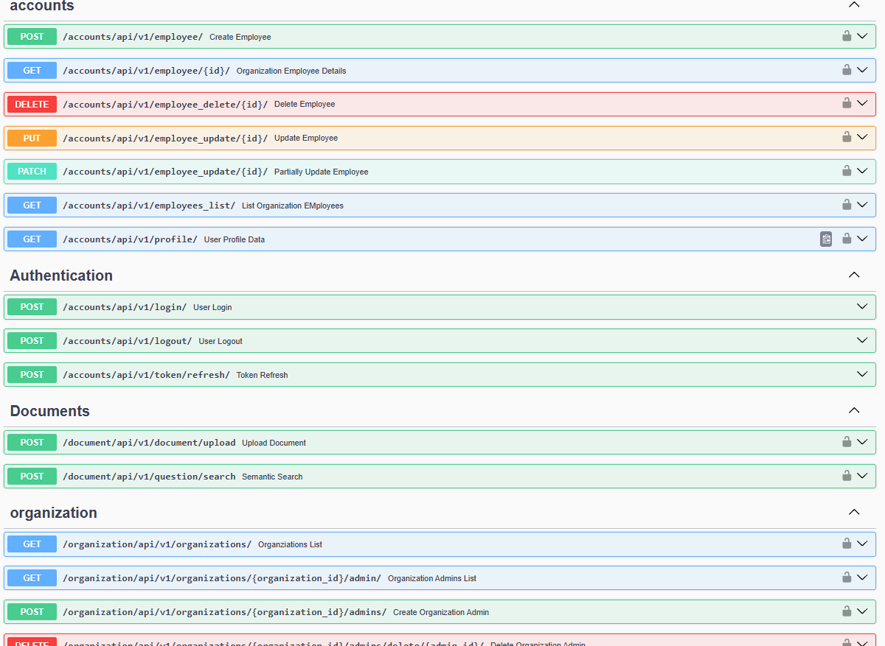
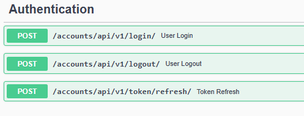
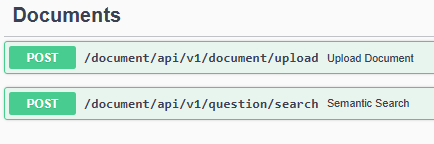
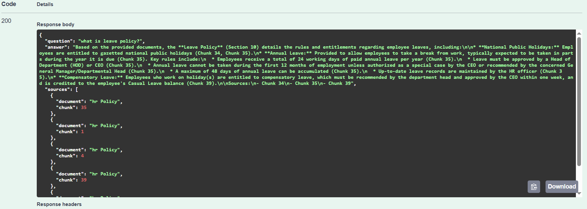
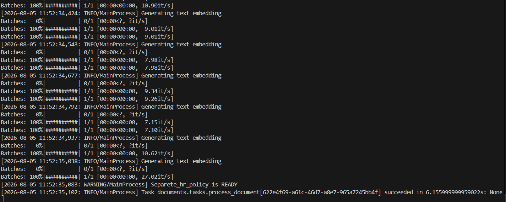

# Enterprise RAG AI Knowledge Platform

A production-ready, multi-tenant Retrieval-Augmented Generation (RAG) platform that enables organizations to interact with their internal knowledge through natural language.

Employees can ask AI-powered questions and receive accurate, cited answers from their organization's documents while maintaining complete tenant isolation.

> Built with Django, Django REST Framework, PostgreSQL, pgvector, Celery, Redis, Docker,RAG and Large Language Models.

---

## API Preview

### Swagger Overview

### API Overview



### Authentication APIs



### Document Management APIs



### AI Question Answering



### Asynchronous Document Processing

Document uploads are processed asynchronously using Celery. Each uploaded document is chunked, converted into embeddings, and indexed in the vector database without blocking the API.

Chunking : 




---

## Problem We Solve

Organizations often store critical knowledge across PDFs, Word documents, internal wikis, manuals, and policies. As this information grows, employees spend significant time searching through documents or asking colleagues for answers, leading to reduced productivity and inconsistent information.

General-purpose AI assistants also cannot reliably answer organization-specific questions because they lack access to private internal knowledge.

This project addresses these challenges by providing a secure, multi-tenant Retrieval-Augmented Generation (RAG) platform that:

- Enables employees to ask questions in natural language.
- Retrieves the most relevant information from their organization's documents using semantic search.
- Generates AI-powered answers grounded in retrieved context.
- Provides source citations for transparency and verification.
- Ensures complete data isolation between organizations through a multi-tenant architecture.

The result is a faster, more reliable way for organizations to access and leverage their internal knowledge while maintaining security, accuracy, and scalability.

---

## Features

### Authentication & Security
- JWT Authentication
- Token Refresh
- Secure Logout (JWT Blacklisting)
- Role-Based Access Control (RBAC)

### Multi-Tenant Management
- Organization Management
- Organization Admin Management
- Employee Management
- Complete Tenant Data Isolation

### API
- RESTful APIs built with Django REST Framework
- Interactive API documentation with Swagger/OpenAPI
- Request validation and error handling

### AI Pipeline 
- Document Upload
- Asynchronous Document Processing with Celery
- Text Chunking
- Embedding Generation
- Vector Storage using pgvector
- Semantic Search
- Retrieval-Augmented Generation (RAG)
- AI-powered Question Answering
- Source Citations

### Infrastructure
- PostgreSQL Database
- Redis Message Broker
- Dockerized Development Environment

---

## Tech Stack

| Category | Technologies |
|----------|--------------|
| Backend | Django, Django REST Framework |
| Database | PostgreSQL, pgvector |
| Background Tasks | Celery, Redis |
| AI | Google Gemini, Sentence Transformers, Retrieval-Augmented Generation (RAG) |
| Containerization | Docker |
| API Documentation | drf-spectacular (OpenAPI/Swagger) |
| Authentication | JWT (Simple JWT) |

---
## System Architecture

```text
                    User
                      │
                      ▼
              Django REST API
                      │
        ┌─────────────┴─────────────┐
        ▼                           ▼
 Authentication              Organization Service
                                      │
                                      ▼
                               Document Upload
                                      │
                                      ▼
                               Celery + Redis
                                      │
                                      ▼
                          Document Processing
                                      │
                                      ▼
                           Embedding Generation
                                      │
                                      ▼
                        PostgreSQL + pgvector
                                      │
                                      ▼
                           Semantic Retrieval
                                      │
                                      ▼
                          Large Language Model
                                      │
                                      ▼
                     AI Response + Source Citations
```

---

## Project Workflow

Employee asks a question
        │
        ▼
JWT Authentication
        │
        ▼
Generate Question Embedding
        │
        ▼
Semantic Search (pgvector)
        │
        ▼
Retrieve Top-K Chunks
        │
        ▼
Build Prompt
        │
        ▼
Gemini LLM
        │
        ▼
Answer + Source Citations


---

## Document Processing Pipeline

Upload PDF
    │
    ▼
Extract Text
    │
    ▼
Chunk Document
    │
    ▼
Generate Embeddings
    │
    ▼
Store in PostgreSQL + pgvector

---

## Project Structure

```text
enterprise-rag-ai-knowledge-platform/
│
├── accounts/
├── organizations/
├── documents/
├── embeddings/
├── rag/
├── core/
├── manage.py
├── requirements.txt
└── README.md
```


---

## API Overview

The platform exposes RESTful APIs for:

- Authentication (JWT)
- Organization Management
- Organization Administrator Management
- Employee Management
- Document Management
- AI Question Answering

Interactive API documentation is available through Swagger/OpenAPI.

---

## Environment Variables

DJANGO_SECRET_KEY=your-django-key


POSTGRESQL_DATABASE_USER=your-postgres-user
POSTGRESQL_DATABASE_NAME=your-postgress-database_name
POSTGRESQL_DATABASE_PASSWORD=postgress-password


JWT_SECRET_KEY=your_JWT_secret_key
GEMINI_API_KEY=your_gemini_api_key

GEMINI_MODEL =your_selected_model


---

## Skills Demonstrated

This project demonstrates practical experience with:

- Enterprise Backend Development
- Multi-Tenant Architecture
- REST API Design
- Authentication & Authorization
- Role-Based Access Control (RBAC)
- Asynchronous Task Processing
- PostgreSQL Database Design
- Vector Databases (pgvector)
- Semantic Search
- Retrieval-Augmented Generation (RAG)
- Large Language Model Integration
- Dockerized Development
- API Documentation (OpenAPI/Swagger)